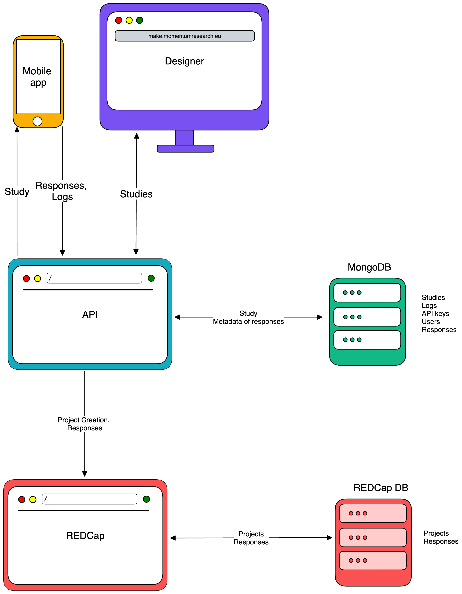

# Architecture

The architecture of the backend involves the multiple services in the form of docker containers which are orchestrated using docker-compose. Docker and Docker Compose are used to make the project scalable and a modular application consisting of several services that are connected through a reverse proxy. 

# Diagram of the flow
The following diagram explains the flow of the backend server.
1. Designer: Using the `Designer` website, a researcher can design a study and then save it in `mongodb` database via the `api`. The `api` then retrieves a `study_id` and a link to the location of the study.
2. Mobile app: Using the mobile app, users can enroll in a study using the link provided by the researcher. This link will be used to get the `Study` in a `JSON` format from the database. Study participants also enter their responses in the mobile app and send their responses via a `POST` url specified in the `Study`. The url will contain the response data, and via the `api`, it's sent to the `Mongodb` and the `RedCap`.
3. API: The api has several request options for GET and POST methods. They are listed in the `components` section of the backend. They are all used for data fetching and data storing in the database. This interaction and request methods are all written in RUST. Take a look into RUST here for further knowledge on how it works. The `RUST` is written with `Rocket` as the web framework.
4. REDCap: The REDCap is hosted in our server. REDCap comes with a user friendly UI with tutorials and guides on how to use it. For further information, use this URL after installing REDCap on your server and have a base URL. 
    ```
    https://{{BASE_URL}}/redcap/index.php?action=training
    ```
    The REDCap is where you can get the responses collected from the mobile app. As a researcher, using your REDCap `username`, you can create projects via the `Designer` website and save your `Study` information. This can assist in the response collection from the mobile app.
5. MongoDB: This is where `response metadata`, `Studies`, `Logs`, `API keys` and `Users` information are stored. The specific on the data schema in each specific database can be found in the interface section.

6. REDCap DB: The projects and reponses for each specific user is stored here. To access informations on the REDCap DB, one needs a `api_super_token`, `api_token` and `api_url`. More on this can be found here:

    ```
    https://{{BASE_URL}}/redcap/api/help/index.php?content=default
    ```
## Flow Diagram



